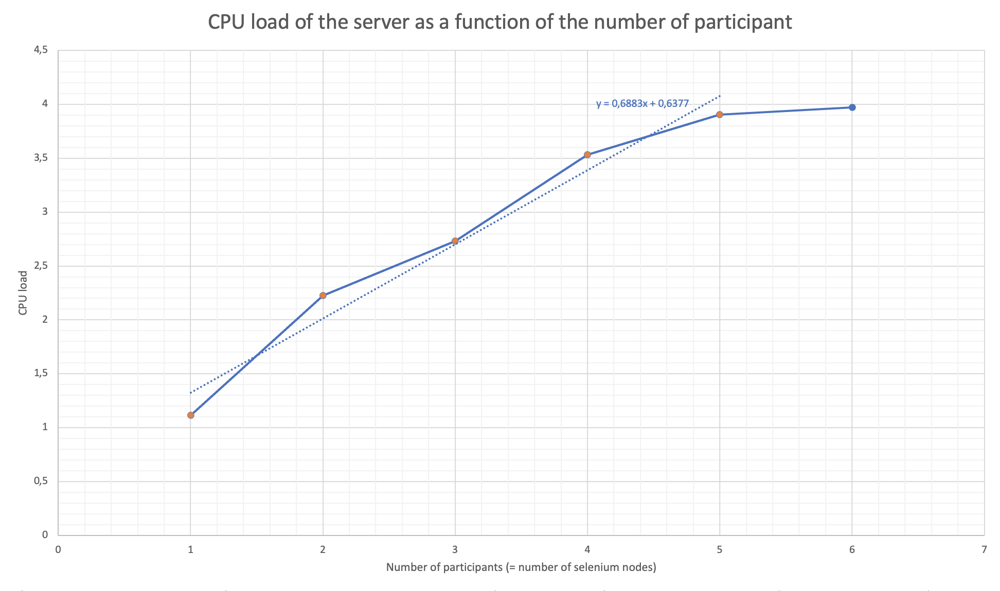
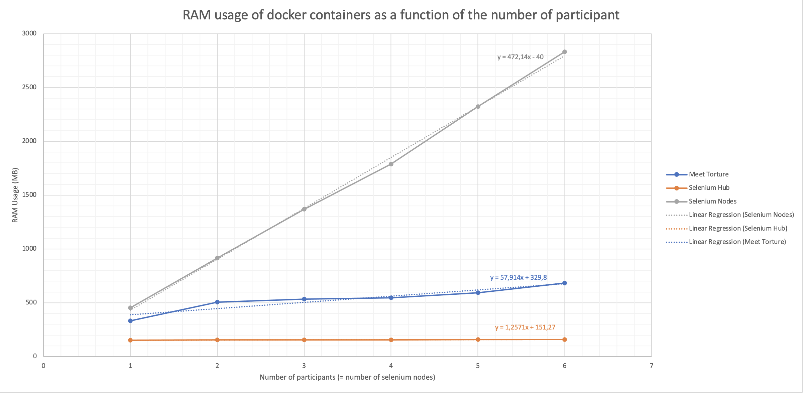

# Load test n°2, 24/02/2022

## Context 

We are looking for a way to test our Jitsi infrastructure, set up on a Kubernetes cluster deploy with [this repository](https://github.com/openfun/jitsi-k8s). We realized that we could not launch concluant tests without deploying Jitsi Meet Torture instances on the cloud; in order to do so, we must know what ressources are necessary to run the load tests to scale our testing infrastructure.

This test will allow us to understand what are the relevant metrics to take into account when we determine how to deploy load test into the cloud.

---

## Description of the infrastucture

The Jitsi infrastucture we are working on is deployed on Kubernetes on Scaleway. It is strong enough to handle the load of the tests.

---

## Approach

These are the specs we chose for the testing server deployed on Scaleway:
- Debian server
- 4 CPU
- 8GB of RAM
- 1 participant per node 

We also added 2 real-life participants with their camera on for every tests, on every room.

We stopped the tests when we started seeing some lack of resources (and therefore poor quality streams) on the testing infrastructure. We made sure our Jitsi infrastructure never reached its limits during those tests.

We did two types of test:
1. One conference, each of them sends an audio and video sample: increase of the number of participants
2. Two participants per conference, one of them sends an audio and video sample, the other just receives the samples: increase of the number of conference

To monitor the metrics, we used `htop` for CPU load, `ctop` for docker container RAM usage and `bmon` for bandwidths.

---

## Results

### First Test

| SENDERS | RAM Meet-torture (MB) | RAM Selenium-Hub (MB) | RAM Selenium-Node (sum) (MB) | RX (KB) | TX (KB) | CPU TOTAL |
| ------- | --------------------- | --------------------- | ---------------------------- | ------- | ------- | --------- |
| 1       | 332                   | 153                   | 453                          | 102     | 52      | 1,115     |
| 2       | 506                   | 154                   | 915                          | 289     | 72      | 2,228     |
| 3       | 535                   | 154                   | 1368                         | 591     | 110     | 2,734     |
| 4       | 546                   | 156                   | 1787                         | 773     | 142     | 3,531     |
| 5       | 593                   | 158                   | 2322                         | 1000    | 215     | 3,905     |
| 6       | 683                   | 159                   | 2830                         | 235     | 127     | 3,97      |




### Second test

| SENDERS | RAM Meet-torture (MB) | RAM Selenium-Hub (MB) | RAM Selenium-Node (sum) (MB) | RX (KB) | TX (KB) | CPU TOTAL |
| ------- | --------------------- | --------------------- | ---------------------------- | ------- | ------- | --------- |
| 2       | 724                   | 175                   | 1972                         | 130     | 79      | 3,123     |
| 3       | 707                   | 197                   | 2895                         | 140     | 85      | 3,738     |
| 4       | 978                   | 181                   | 3709                         | 1600    | 23      | 4         |

---

## Interpretation of results

Firstly, some of the metrics do not seem relevant. Indeed, we can see that studying RX/TX makes no sense here, especially because the monitoring on this metrics seems not to be very reliable. 

Then we can observe that the Selenium-Hub RAM usage is constant and the Meet-Torture RAM usage is nearly constant. The Selenium-Node RAM usage seems to have a linear expression, be it with the first or the second experiment. It is proportional to the number of participants and is independant from the number of conferences.

We can see that the CPU reaches its limit fast and seems to be the limiting factor in our experiment. We couldn't add more that 6 participants without degrading the quality of the conferences. According to the two experiments, the CPU load largely depends on the number of participants; the number of conferences has only a little influence on it. Note that:
- we launched every instance of Meet Torture at the same time, which seems to have an impact on the load especially at the beginning of the tests (where the measures are taken): scattering the launches may improve performances.
- at the end of both tests, we reached the limits of CPU load, so the values may be spurious.

---

## Conclusion

When it comes to choose servers for load testing, there are two key factors to take into account:
- the maximum CPU load that must support the CPU consumption of the Docker Containers.
- the maximum RAM usage that mostly limits the number of Selenium Nodes that can be launched on the server.

Our experimentation and the linear regressions leads us to the rough estimations:

```
CPU = number of participants * 0.7 + 0.6
RAM = number of participant * 470 MB + 330 MB + 150 MB
```