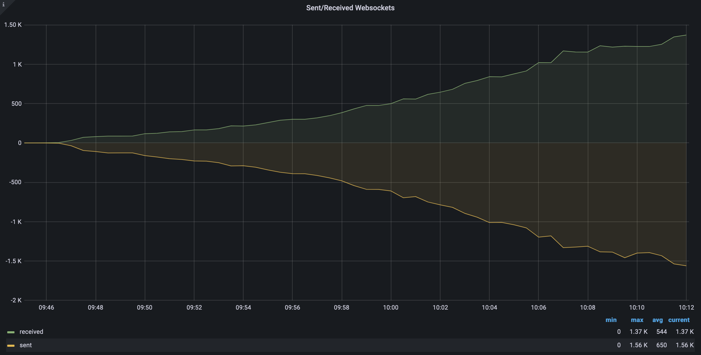
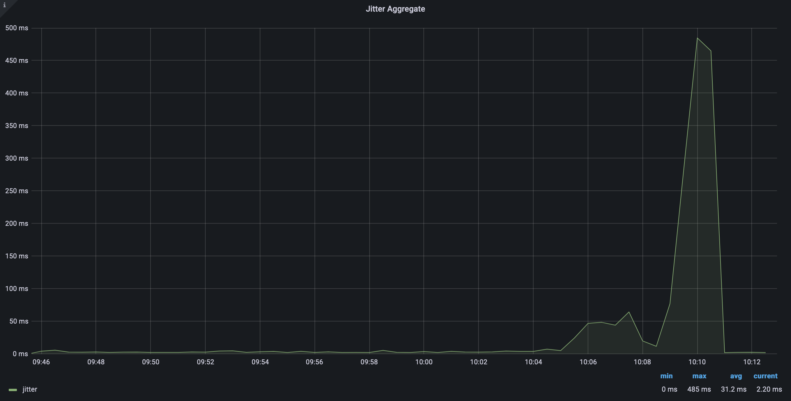
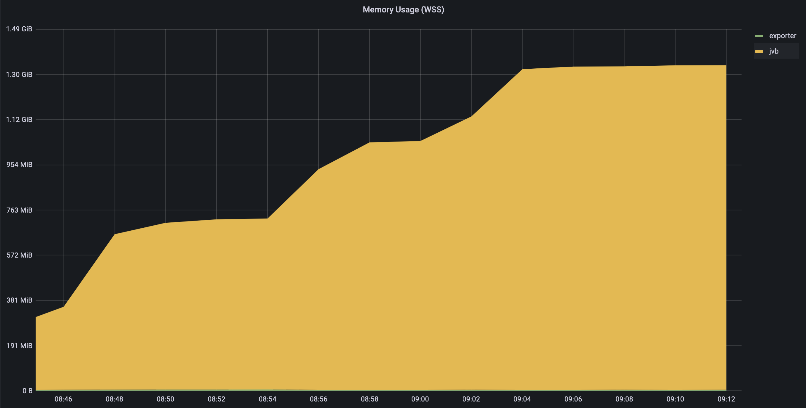
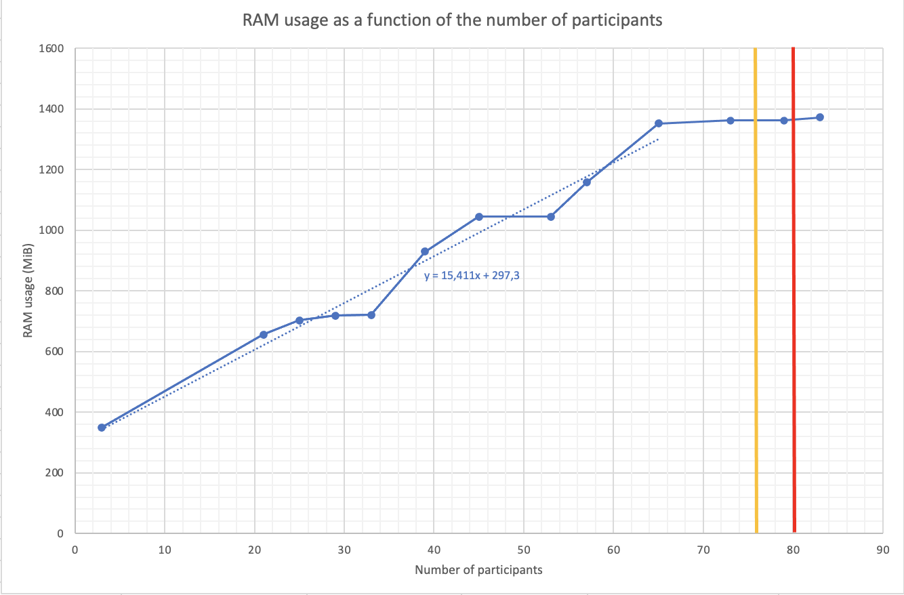
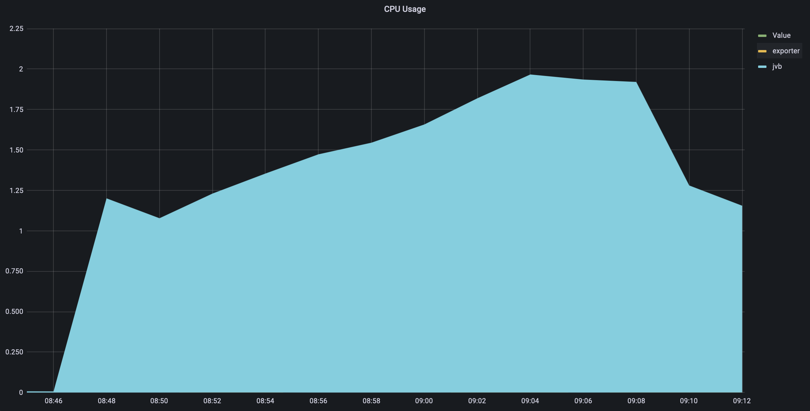
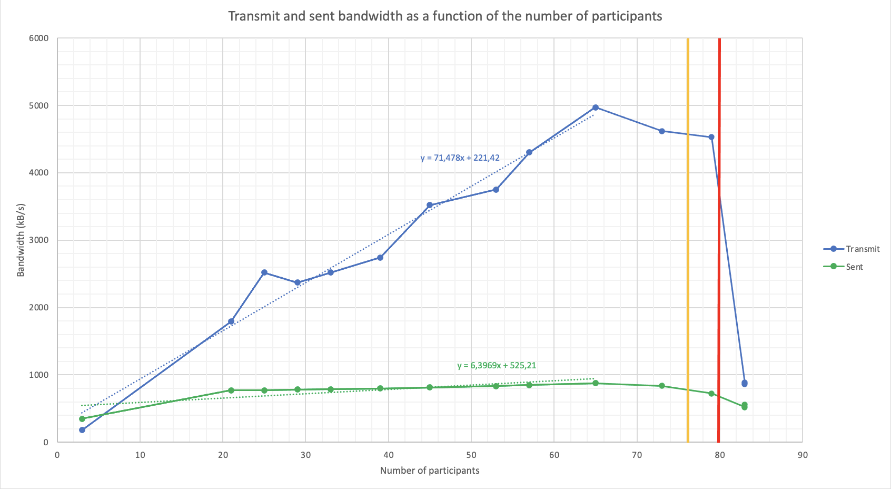
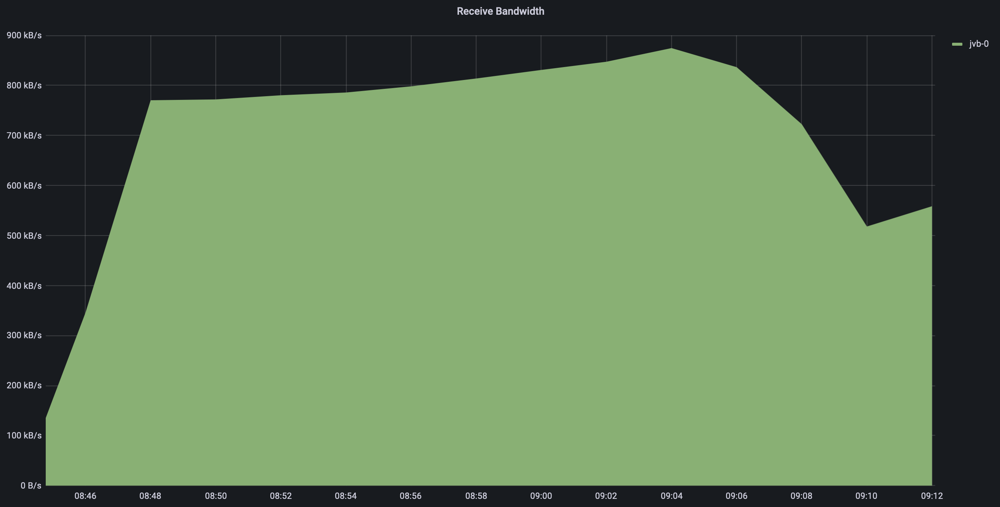
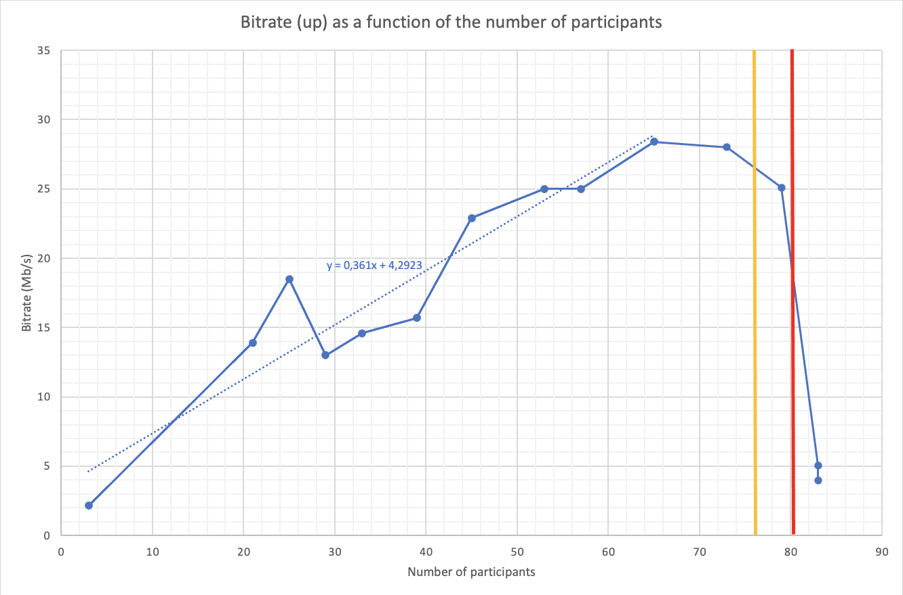
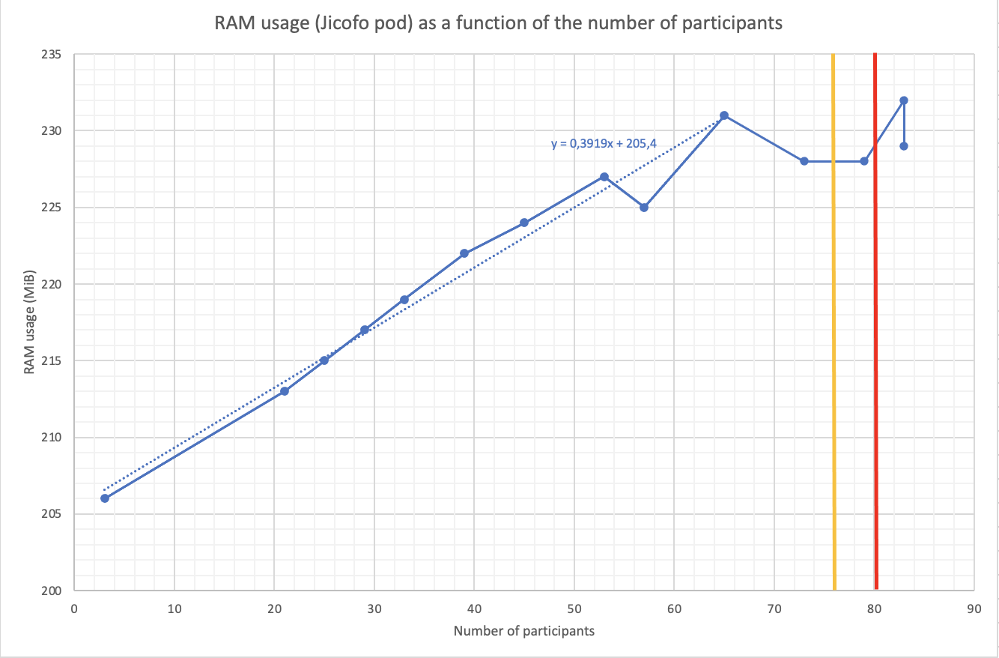
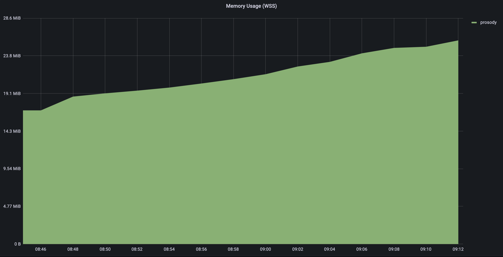

# Load test n°4, 11/03/2022

## Context 

We want to test the maximum number of participants in one conference in Jitsi Meet. In the same time, we would like to explore the different metrics that are fetched on the infrastructure and be able to estimate the values of those metrics.

---

## Description of the infrastucture

The Jitsi infrastucture we are working on is deployed on Kubernetes on Scaleway. It is based on the deployment available on the [jitsi-k8s repository of OpenFUN](https://github.com/openfun/jitsi-k8s/tree/59bdc9c799db3f0decedbb4b6f870f246091d7c8). More precisely, here are the specs of the JVB nodepool on our cluster:
- 1 server
- 4 CPU
- 16 GB of RAM
- 1 pod
- no HPA
- no resource limits on the JVB pod

---

## Approach

We deployed Jitsi-Meet-Torture instances in the cloud (on multiple instances on Scaleway) to apply a high load on the infrastructure. We can therefore legitimately assume that we emulate the perfect participants in our conferences that send and receive audio and video without any client-side limit.

We added participants to one conference little by little until the quality becomes to be degraded and video streams are automatically shutdown or not visible on one real-life participant who is connected to the conference.

---

## Results

All metrics were gathered with Prometheus and visualized with Grafana.

From the beginning of the tests, there were only 10 participants that were sending both audio and video samples: Jitsi turns down microphone and cameras by default from this number of participants. Besides, at a certain points, there were additional audio and videos samples that was not received by our real-life participant (but the microphones and cameras of the senders were on because the real-life participant alternatively received samples from all the senders):
- from ~76 participants: 2/10 cameras appeared as turned off (delimited by a yellow vertical line in charts).
- from ~80 participants: 8/10 cameras appeared as turned off (delimited by a red vertical line in charts).
This aspect must be taken into account when interpreting graphs and charts.

The number of participants have been tracked down to follow the evolution of metrics in terms of participants:

### Results on the Jitsi service

| Metric           | Graph                                               | Chart analysis                                      | Notes                                                                                         |
| ---------------- | --------------------------------------------------- | --------------------------------------------------- | --------------------------------------------------------------------------------------------- |
| Websockets       |              |  | Messages received through COLIBRI web sockets.                                                |
| RTT              |                            | (Too fluctuating to be quantified)                  | [Round Trip Time](https://en.wikipedia.org/wiki/Round-trip_delay)                             |
| Jitter aggregate |  | (Too fluctuating to be quantified)                  | (Experimental) [Packet delay variation](https://en.wikipedia.org/wiki/Packet_delay_variation) |

### Results on the Jitsi Video Bridge

| Metrics            | Graph                                                   | Chart analysis                                        | Notes                                         |
| ------------------ | ------------------------------------------------------- | ----------------------------------------------------- | --------------------------------------------- |
| RAM usage          |                        |          | (Metric fetched from the Kubernetes exporter) |
| CPU load           |                        |          | (Metric fetched from the Kubernetes exporter) |
| Transmit bandwidth |  |      | (Metric fetched from the Kubernetes exporter) |
| Received bandwidth |  | (On the chart above)                                  | (Metric fetched from the Kubernetes exporter) |
| Packet rate        |                |  | (Metric fetched from the Jitsi API)           |
| Bitrate            |                        |          | (Metric fetched from the Jitsi API)           |

### Results on the other Jitsi components

| Metrics              | Graph                                     | Chart analysis                                      |
| -------------------- | ----------------------------------------- | ----------------------------------------------------|
| RAM usage on Jicofo  |    |  |
| CPU load on Jicofo   |    | (Too small to be quantified)                        |
| RAM usage on Prosody |  |        |
| CPU load on Prosody  |  | (Too small to be quantified)                        |

---

## Interpretation of results

There following metrics can reasonably be modeled as linear function of the number of participants: number of websockets, RAM usage on JVB, CPU load on JVB, transmit and received bandwidth, packet rate and bitrate. Note that the metric that fits best to this model seems to be the packet rate.

The RTT and Jitter aggregate metrics are too fluctuating to be quantified, but they seem to rather well predict when the conference will reach its limit, and especially the Jitter aggregate metric that presents a distinct spike (here at 10h07).

About the other components of Jitsi, we learn that the CPU loads on the Jicofo and Prosody pods stay very low and constant during the entire test (it will not be the limiting factor). However, the RAM usage of these components seems to be linear in the number of participants, with a slope that is between 40 and 1500 times smaller than the slope of the JVB RAM usage linear approximation.

Compared to the [Load Test n°3](../2022-02-24/Load-test-2022-02-24.md) (with numerous conferences), the slope of the linear approximation of the RAM usage appears to be 1.5 times higher and the slope of the linear approximation of the CPU load 2.8 times higher (note that the latter may be distorted because of the first point). We may interprete this result as the consequences of having more participants in conferences and therefore more streams sent to the clients.

---

## Conclusion

The maximum number of people that a conference can handle with 10 audio and video streams seems to be **between 70 and 80 participants**, with disturbance that begin to append from 70 participants.

Numerous approximated formulas may be deducted from the linear approximations on the charts.
