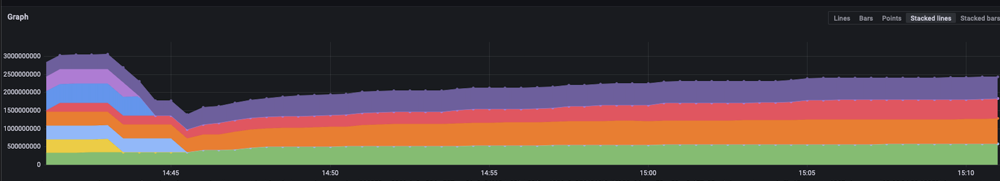
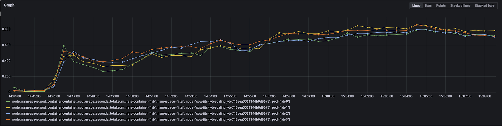
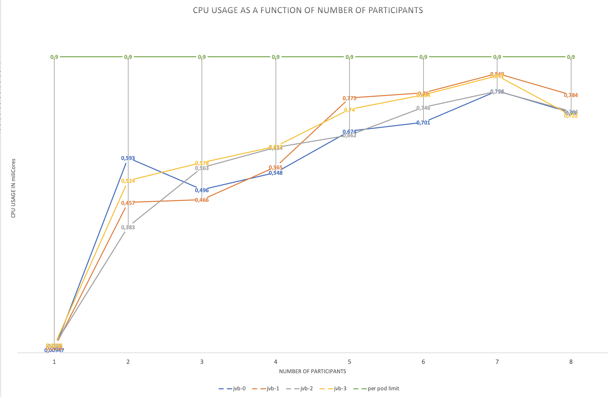

# Load test n°5, 14/03/2022

## Context 

We want to reproduce a test similar to [Load Test n°4](../2022-03-11/Load-test-2022-03-11.md), but this time with smaller JVBs on the same sized node. We want to see if we reach the same limit, if there are phenomenas that show that multiple JVBs are better than one...

## Description of the infrastucture

The Jitsi infrastucture we are working on is deployed on Kubernetes on Scaleway. It is based on the deployment available on the [jitsi-k8s repository of OpenFUN](https://github.com/openfun/jitsi-k8s/tree/59bdc9c799db3f0decedbb4b6f870f246091d7c8). More precisely, here are the specs of the JVB nodepool on our cluster:
- 1 server
- 4 CPU
- 16 GB of RAM
- 4 pods, limited by 900 miliCores and 3,5GB RAM each
- no HPA

Specs of the torture instances:
- 2 CPU
- 2 GB of RAM
- 2 participants per instance

## Approach

We deployed Jitsi-Meet-Torture instances in the cloud (on multiple instances on Scaleway) to apply a high load on the infrastructure. We can therefore legitimately assume that we emulate the perfect participants in our conferences that send and receive audio and video without any client-side limit.

We added participants to one conference slowly, adding 10 people every time the 10 we applied before appeared on the stream, until the quality became degraded and video streams were automatically shutdown or not visible for one real-life participant who was connected to the conference.

## Results

All metrics were gathered with Prometheus and visualized with Grafana.

At any given time, there were only 10 participants with video and audio turned on, as Jitsi shuts down cameras and microphones of the people that connect when they are more than 10 participants. However, adding people increased the number of streams that were fetched from the JVBs, and increased their load (in CPU notably) significantly.

At around ~65 participants, each JVB was between 80% and 90% of its max CPU usage. Jitsi then began to shutdown some participants' videos: at 64 participants, there were 7/10 cameras, and at 70 participants, there were only 7/10.

The number of octo endpoints have been tracked down thanks to a jitsi prometheus metric. Beware, this is not completely equal to 4 times the amount of participants in the conference.

### Results on the Jitsi Video Bridge

| Metrics            | Graph                                                   | Chart analysis                                        | Notes                                         |
| ------------------ | ------------------------------------------------------- | ----------------------------------------------------- | --------------------------------------------- |
| RAM usage per pod  |                        |          | (Metric fetched from the Kubernetes exporter) |
| CPU load per pod   |                        |          | (Metric fetched from the Kubernetes exporter) |

## Interpretation of results

We observe that we arrive very soon at the limit in cpu per pod.

In [Load Test n°4](../2022-03-11/Load-test-2022-03-11.md), when there was a drop in performance, only 2 cores where used, and there were around 75 participants. Here, we use all 4 cpus at 65 participants. Thus, multiple JVB take more resources, and limit jitsi more.

This is due to the fact that having multiple peole in the same conference on multiple JVBs (thanks to Octo) multiplies the number of connections needed and creates more stress on the JVBs, as each participant will contact all JVBs where there are people with cameras and audio turned on.

However, remains the question of if the JVB process can go use more than 2 CPUs. If it is not the case, then the optimum is to use multiple JVBs that use 2 CPUs each.

## Conclusion

Multiple JVBs create more demand in resources because of Octo connections. Thus it is not more efficient to create multiple small JVBs whose CPU demand is lower than the max CPU that the JVB process can use.

We have to test with JVBs that have exactly the number of cores that the JVBs can reach, to see if it is the optimal configuration.

However, [Quick test n°1](../quick_tests/2022-03-16/Quick-test-2022-03-16.md) showed that jitsi-meet-torture instances were limiting, so the number of maximum participants with 4 JVBs is higher than what this test shows. But the higher demand in resources with multiple JVBs remains true.
