# Load test n°6, 17/03/2022

## Context 

We want to reproduce a test similar to [Load Test n°4](../2022-03-11/Load-test-2022-03-11.md), but this time with bigger jitsi-meet-torture instances, as we saw in [Quick test n°1](../quick_tests/2022-03-16/Quick-test-2022-03-16.md), because the instances we used in Load test n°4 limited the test.

## Description of the infrastucture

The Jitsi infrastucture we are working on is deployed on Kubernetes on Scaleway. It is based on the deployment available on the [jitsi-k8s repository of OpenFUN](https://github.com/openfun/jitsi-k8s/tree/59bdc9c799db3f0decedbb4b6f870f246091d7c8). More precisely, here are the specs of the JVB nodepool on our cluster:
- 1 server
- 4 CPU
- 16 GB of RAM
- 4 pods, limited by 900 miliCores and 3,5GB RAM each
- no HPA

And specs of the torture instances:
- 3 CPU
- 4 GB of RAM
- 2 participants per instance

## Approach

We deployed Jitsi-Meet-Torture instances in the cloud (on multiple instances on Scaleway) to apply a high load on the infrastructure. We can therefore legitimately assume that we emulate the perfect participants in our conferences that send and receive audio and video without any client-side limit.

We added participants to one conference slowly, adding 10 people every time the 10 we applied before appeared on the stream, and finally adding 50 participants when jvb instance did not want to shut down even if it was overloaded for a long time.

Jvb never shut down, even after more than 30 minutes at 98% cpu usage. We finally shut everything down ourselves at 200 participants.

## Results

All metrics were gathered with Prometheus and visualized with Grafana.

At any given time, there were only 10 participants with video and audio turned on, as Jitsi shuts down cameras and microphones of the people that connect when they are more than 10 participants. However, adding people increased the number of streams that were fetched from the JVBs, and increased their load (in CPU notably) significantly.

At around ~80 participants, JVB was at more than 90% cpu usage, and never dropped below this afterwards. However, streams still kept their quality, and no one was kicked or muted.

At around ~150 participants, video quality became poor. But no one was kicked or muted. We can see this in following screenshot:
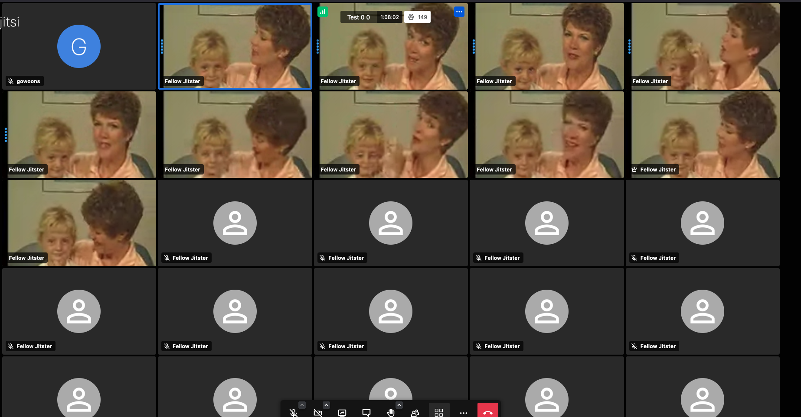

At max participants, 200 participants, it was hard to see video streams, but we could still hear bugged audio, and everyone was still in the conversation.

Participants as a function of time are shown here:
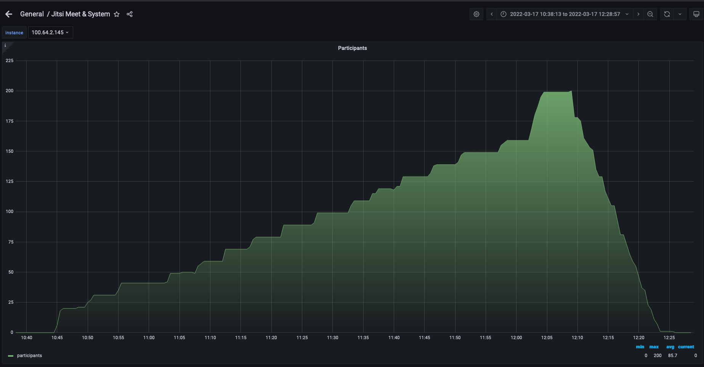

### Results on the Jitsi service

| Metric           | Graph                                               | Notes                                                                                         |
| ---------------- | --------------------------------------------------- | --------------------------------------------------------------------------------------------- |
| Websockets       | 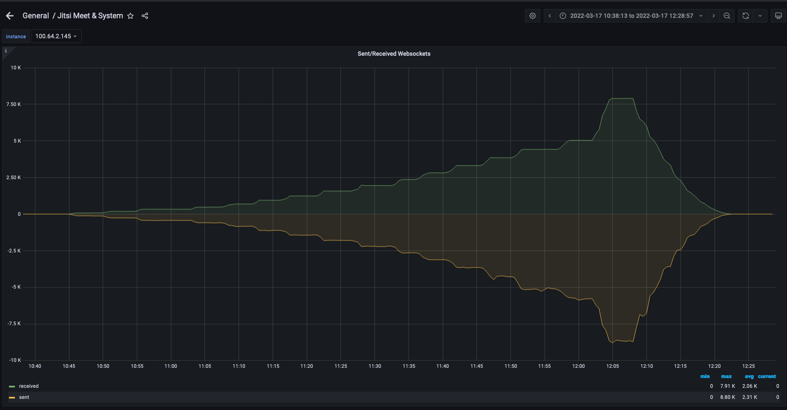             | Messages received through COLIBRI web sockets.                                                |
| Stress level              | 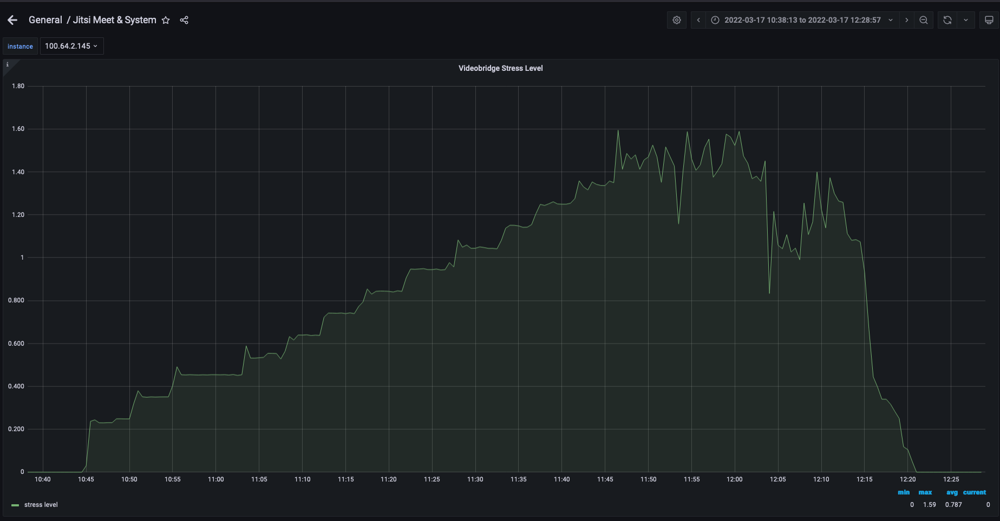                           | JVB stress level                             |
| RAM usage front  | 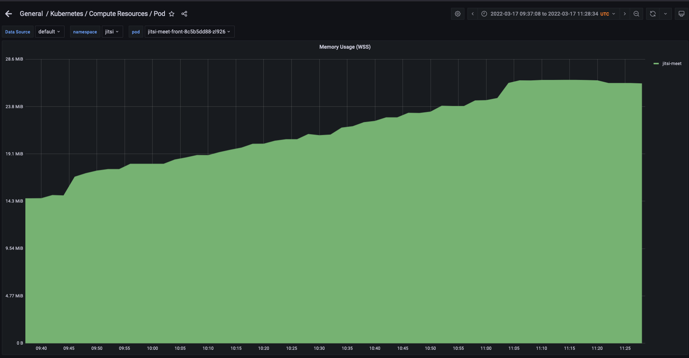                       | Ram usage of the frontend |
| CPU load front   |                        | Cpu load of the frontend |
| Graph of frontend's CPU load | 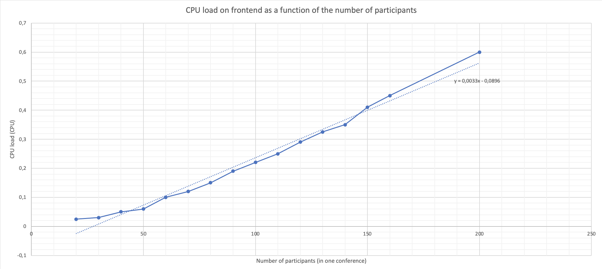                       | Graph and linear approximation of cpu load of frontend  |
| RAM usage prosody  | 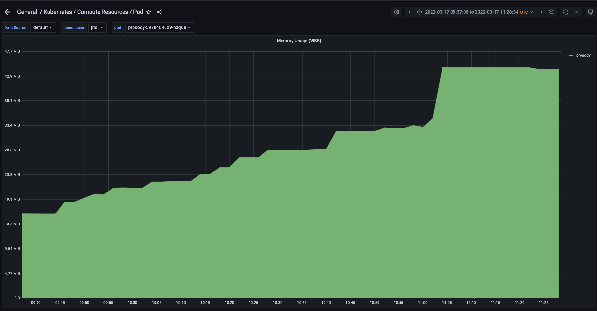                       | Ram usage of prosody |
| CPU load prosody   | 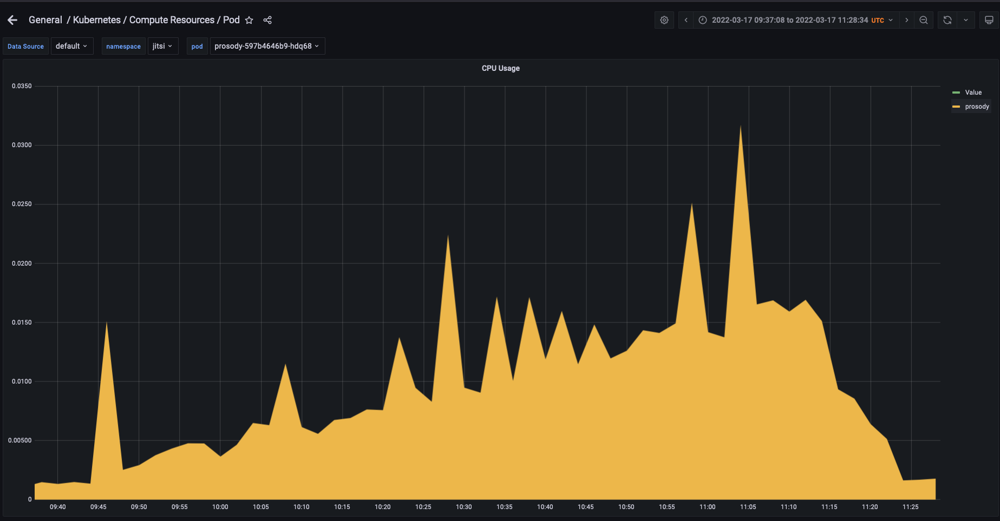                       | Cpu load of prosody |
| RAM usage jicofo  | 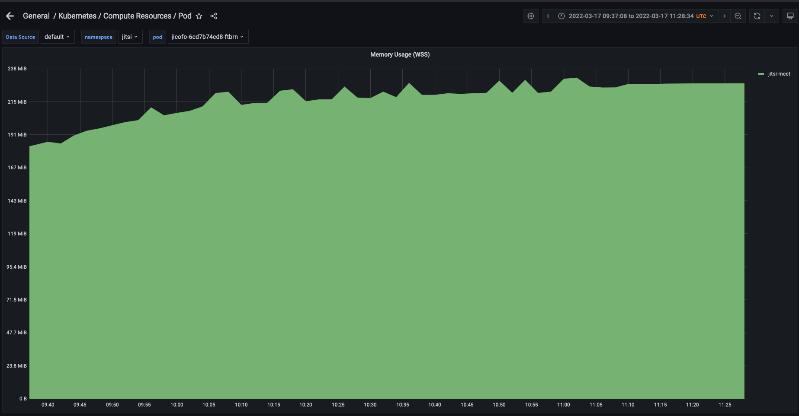                       | Ram usage of jicofo |
| CPU load jicofo   | 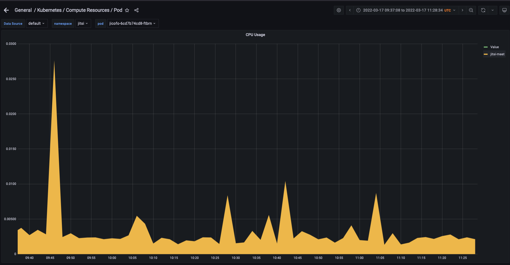                       | Cpu load of jicofo |

### Results on the Jitsi Video Bridge

| Metrics            | Graph                                                   | Chart analysis                                        | Notes                                         |
| ------------------ | ------------------------------------------------------- | ----------------------------------------------------- | --------------------------------------------- |
| RAM usage  | 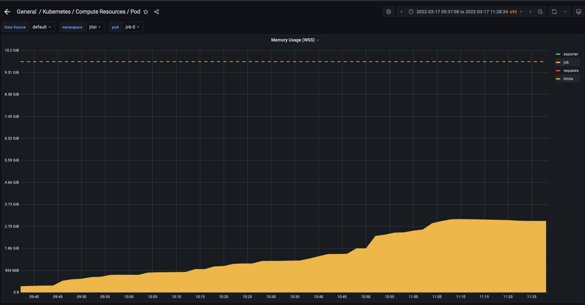                       | 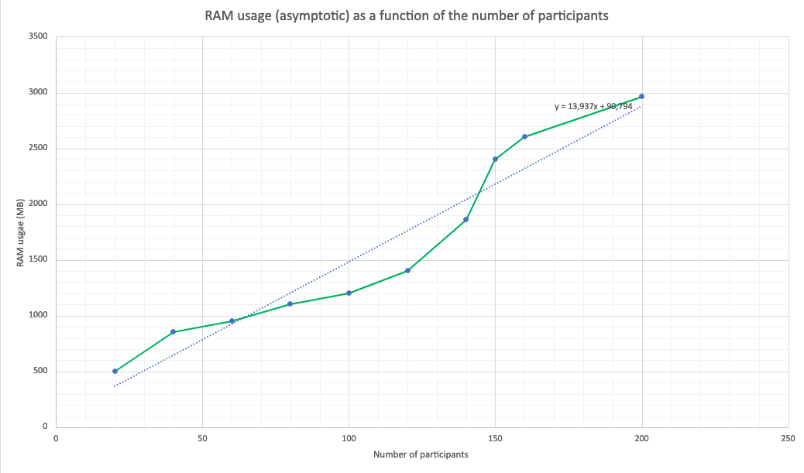         | (Metric fetched from the Kubernetes exporter) |
| CPU load   | 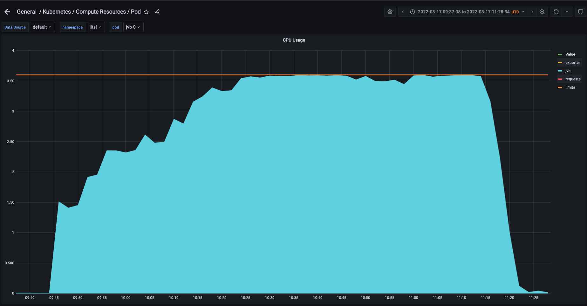                       |          | (Metric fetched from the Kubernetes exporter) |
| CPU throttling   |                        | (No graph)         | (Metric fetched from the Kubernetes exporter) |
| Receive bandwidth   | 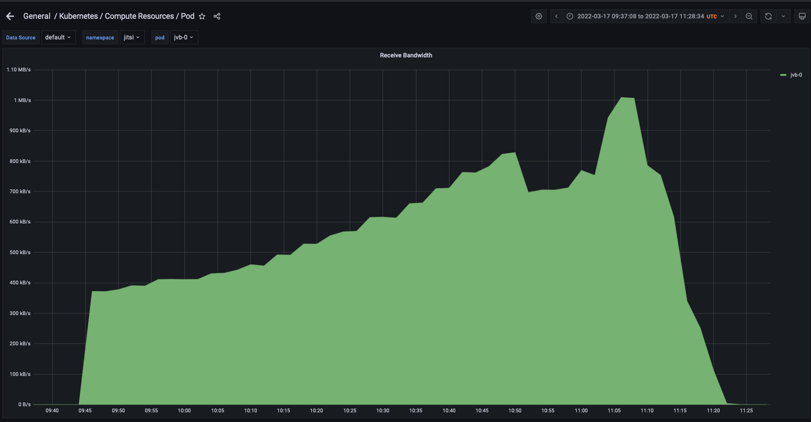                       | (no graph as less important)         | (Metric fetched from the Kubernetes exporter) |
| Transmit bandwidth   |                        |    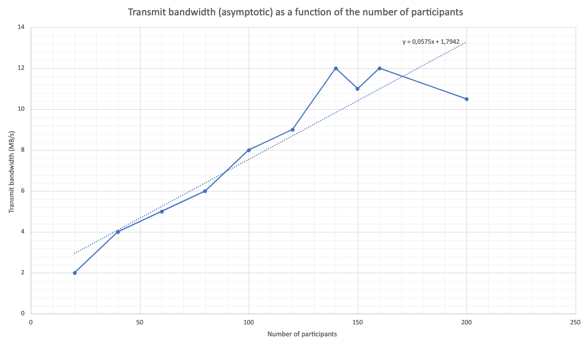      | (Metric fetched from the Kubernetes exporter) |

## Interpretation of results

Even if we arrive soon at limit of JVB, it is still able to handle connections beyond that, which is quite impressive. This is only with one JVB, so results with multiple should be quite positive.

There is a lot of cpu throtthling to handle limited cpu. Ram is way under the limit, and bandwidth too. CPU is what limits the JVB.

This shows that client was indeed limiting for [Load Test n°4](../2022-03-11/Load-test-2022-03-11.md).

When clients leave, CPU levels fall as well, so it could be a good indicator for hpa. The same can be said of bandwidth, but as XS machines allow hundreds of MB of bandwidth, it is not a limit in the same way as cpu.

## Conclusion

One JVB can handle a lot of connections (in the hundreds) even if it is soon limited in cpu. The maximum of clients connected without seeing a drop in quality seems to be *150 participants*, with 10 cameras turned on.

