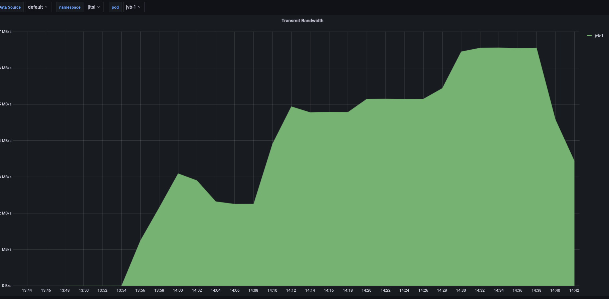

# Load test n°7, 18/03/2022

## Context 

We want to test jitsi and the load on the JVBs, with and without Octo activated, so as to choose the best possibility for the [jitsi-k8s infrastructure of OpenFUN](https://github.com/openfun/jitsi-k8s/).

## Description of the infrastucture

The Jitsi infrastucture we are working on is deployed on Kubernetes on Scaleway. It is based on the deployment available on the [jitsi-k8s repository of OpenFUN](https://github.com/openfun/jitsi-k8s/tree/59bdc9c799db3f0decedbb4b6f870f246091d7c8). More precisely, here are the specs of the JVB nodepool on our cluster:
- 4 servers
- 4 CPU per server
- 16 GB of RAM per server
- 4 pods : one per server
- no HPA
- resource limits on the pods equal to the limits of the servers

Specs of the torture instances:
- 3 CPU
- 4 GB of RAM
- 2 participants per instance

## Approach

There are two Octo strategies tested here : SingleBridge and SplitBridge.

SingleBridge strategy binds a conference to one JVB, and then people connected to that conference have to connect to the JVB.

SplitBridge strategy seperates people from the same conference on different JVBs on purpose, for testing purposes. It is not made to be used in production, but will help us understand the difference between using Octo and not using it.

Each time, 12 conferences were created, and people were slowly added onto them, until there were approximatively 100 people in total.

## Results

All metrics were gathered with Prometheus and visualized with Grafana.

### Results in SingleBridge strategy

Participants joined conferences as shows the following, with red line being the sum of all participants in the different JVBs:

| Metrics            | Graph                                                   | Notes                                         |
| ------------------ | ------------------------------------------------------- | --------------------------------------------- |
| CPU load all JVBs          |                        | (Metric fetched from the Kubernetes exporter) |
| CPU load jvb0           |                        | (Metric fetched from the Kubernetes exporter) |
| CPU load jvb1           |                        | (Metric fetched from the Kubernetes exporter) |
| CPU load jvb2           |                        | (Metric fetched from the Kubernetes exporter) |
| CPU load jvb3           |                        | (Metric fetched from the Kubernetes exporter) |
| CPU throttling jvb2           |                        | Throtthling of most loaded jvb, other jvbs have no cpu throttling |
| Transmit bandwidth jvb0 |  | (Metric fetched from the Kubernetes exporter) |
| Transmit bandwidth jvb1 |  | (Metric fetched from the Kubernetes exporter) |
| Transmit bandwidth jvb2 |  | (Metric fetched from the Kubernetes exporter) |
| Transmit bandwidth jvb3 |  | (Metric fetched from the Kubernetes exporter) |
| Received bandwidth jvb0 |  | (Metric fetched from the Kubernetes exporter) |
| Received bandwidth jvb1 |  | (Metric fetched from the Kubernetes exporter) |
| Received bandwidth jvb2 |  | (Metric fetched from the Kubernetes exporter) |
| Received bandwidth jvb3 |  | (Metric fetched from the Kubernetes exporter) |
| Websockets of overloaded JVB        |                | (Metric fetched from the Jitsi API)          |
| Websockets of normally loaded JVB        |                | (Metric fetched from the Jitsi API)          |

### Results in SingleBridge strategy

Participants joined conferences as shows the following

| Metrics            | Graph                                                   | Notes                                         |
| ------------------ | ------------------------------------------------------- | --------------------------------------------- |
| CPU load all JVBs          |                        | (Metric fetched from the Kubernetes exporter) |
| CPU load jvb0           |                        | (Metric fetched from the Kubernetes exporter) |
| CPU load jvb1           |                        | (Metric fetched from the Kubernetes exporter) |
| CPU load jvb2           |                        | (Metric fetched from the Kubernetes exporter) |
| CPU load jvb3           |                        | (Metric fetched from the Kubernetes exporter) |
| CPU throttling jvb0           |                        | Throtthling of most loaded jvb, other jvbs have little to no cpu throttling |
| Transmit bandwidth jvb0 |  | (Metric fetched from the Kubernetes exporter) |
| Transmit bandwidth jvb1 |  | (Metric fetched from the Kubernetes exporter) |
| Transmit bandwidth jvb2 |  | (Metric fetched from the Kubernetes exporter) |
| Transmit bandwidth jvb3 |  | (Metric fetched from the Kubernetes exporter) |
| Received bandwidth jvb0 |  | (Metric fetched from the Kubernetes exporter) |
| Received bandwidth jvb1 |  | (Metric fetched from the Kubernetes exporter) |
| Received bandwidth jvb2 |  | (Metric fetched from the Kubernetes exporter) |
| Received bandwidth jvb3 |  | (Metric fetched from the Kubernetes exporter) |
| Websockets of one JVB        |                | (Metric fetched from the Jitsi API) Others are very similar          |

### Comparison

We will be comparing singleBridge (in blue-purple) and splitBridge (in yellow-orange).

CPU comparison shows that one jvb of SingleBridge is the most overloaded one, whil all splitBridge JVBs have a load between the most loaded and the second most loaded JVB of singleBridge:

Bandwidth comparison shows that bandwidth when using Octo is quite similar between JVBs. Without Octo (in SingleBridge), the overloaded JVB has more CPU than JVBs with Octo, and other JVBs have a lot less. It is the same phenomenon as CPU.

## Interpretation of results

Even if SingleBridge creates less messaging (we see that bandwidth is less used), this is not the limiting factor: it is the CPU. And, with Octo in Single Bridge, it is easy to overload a JVB which handles too many conferences, with people constantly joining these conferences.

With SplitBridge, the JVBs are more overloaded as a whole, but we don't have the risk of completely overloading one single JVB when others are doing fine.

We have to keep in mind that Split Bridge is for dev purpose only, and [Load Test n°8](../2022-03-21-OCTO-strategy-RegionBased/Load-test-2022-03-21-OCTO-strategy-RegionBased.md) shows that RegionBased, which is for prod, mixes the two solution's best aspects.

## Conclusion

Not using Octo creates a risk that a JVB will be overloaded. It is better to use it, even if it creates more stress on the network.
