# Load test n°8, 21/03/2022

## Context 

This test aims at testing the Octo strategy RegionBased, with only one region: "fr-par".
After choosing to use Octo in [Load Test n°7](../2022-03-18-with-without-OCTO/Load-test-2022-03-18-with-without-OCTO.md), this seems to be the strategy that is most adapted to production.

## Description of the infrastucture

The Jitsi infrastucture we are working on is deployed on Kubernetes on Scaleway. It is based on the deployment available on the [jitsi-k8s repository of OpenFUN](https://github.com/openfun/jitsi-k8s/tree/59bdc9c799db3f0decedbb4b6f870f246091d7c8). More precisely, here are the specs of the JVB nodepool on our cluster:
- 3 servers
- 4 CPU per server
- 16 GB of RAM per server
- 3 pods : one per server
- no HPA
- resource limits on the pods equal to the limits of the servers

Specs of torture instances:
- 3 CPU
- 4 GB of RAM
- 2 participants per instance

## Approach

First, we added people to one conference, until JVB was too overloaded and participants of the conference were put on an other JVB.

Then, we added three conferences of 20 people, to see on which JVB they were first assigned, and how JVBs managed the load.

## Results

Participants joined conferences as shows the following
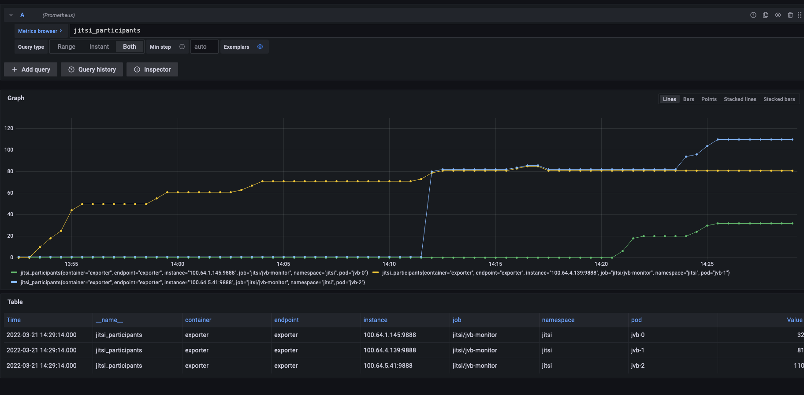

| Metrics            | Graph                                                   | Notes                                         |
| ------------------ | ------------------------------------------------------- | --------------------------------------------- |
| CPU load all JVBs          | 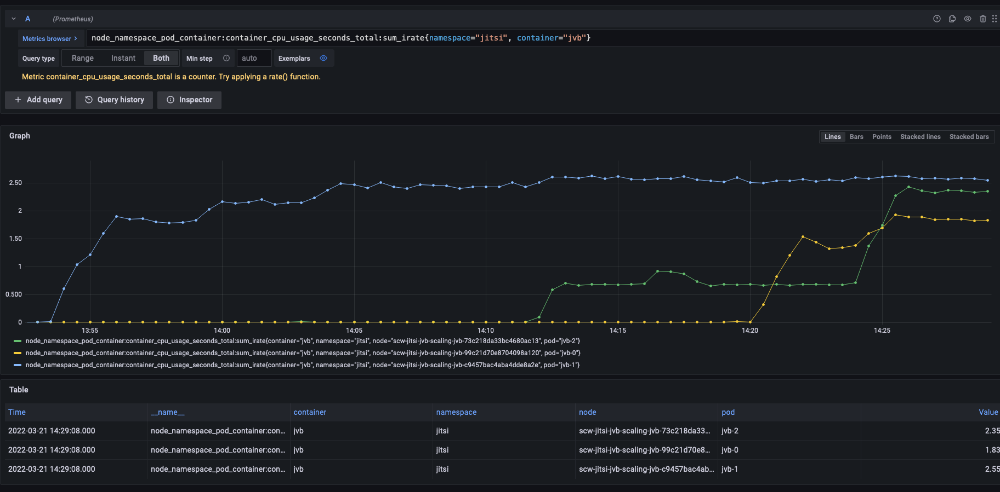                       | (Metric fetched from the Kubernetes exporter) |
| CPU load jvb0           | 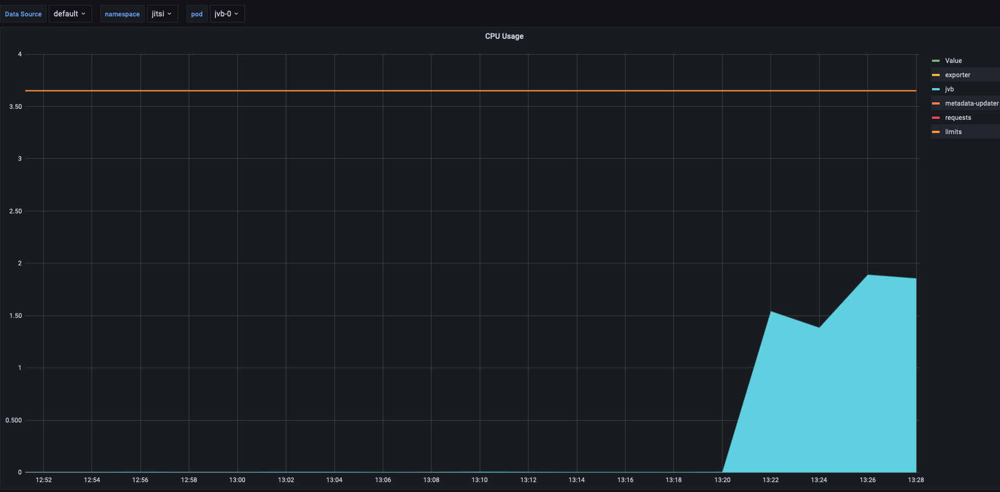                       | (Metric fetched from the Kubernetes exporter) |
| CPU load jvb1           |                        | (Metric fetched from the Kubernetes exporter) |
| CPU load jvb2           | 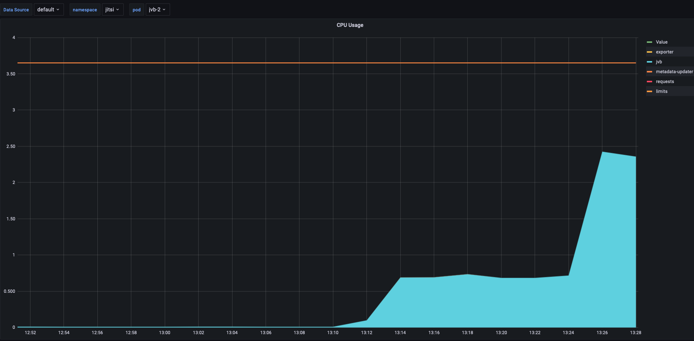                       | (Metric fetched from the Kubernetes exporter) |
| Transmit bandwidth jvb0 | 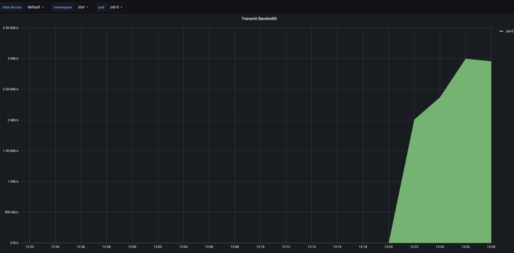 | (Metric fetched from the Kubernetes exporter) |
| Transmit bandwidth jvb1 | 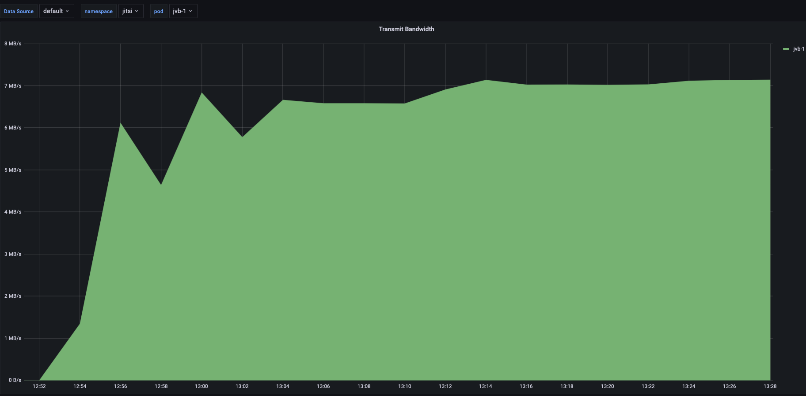 | (Metric fetched from the Kubernetes exporter) |
| Transmit bandwidth jvb2 | 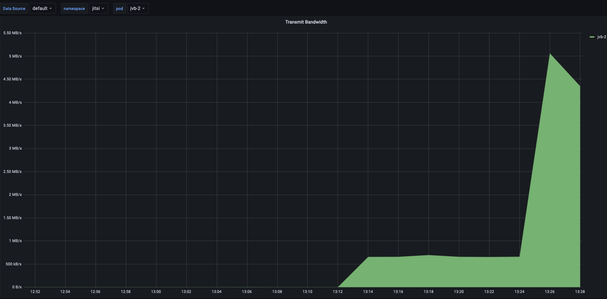 | (Metric fetched from the Kubernetes exporter) |
| Received bandwidth jvb0 | 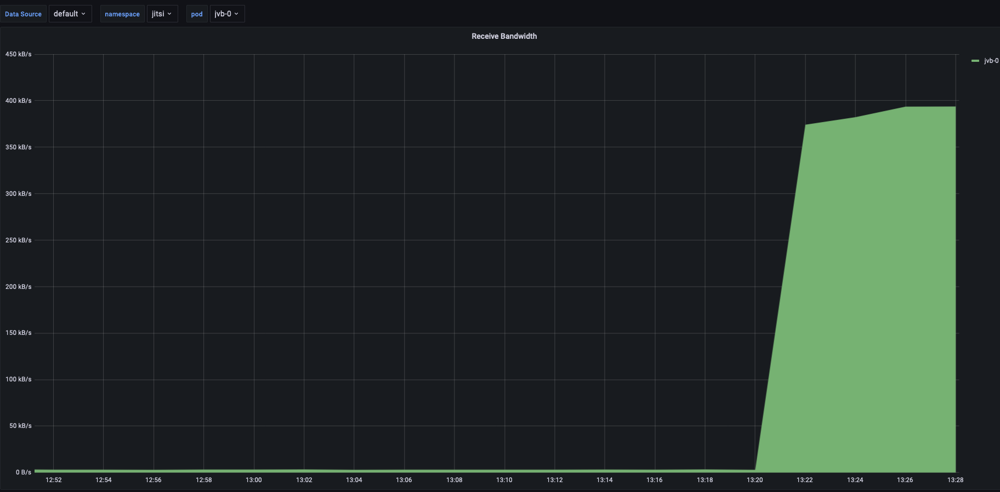 | (Metric fetched from the Kubernetes exporter) |
| Received bandwidth jvb1 | 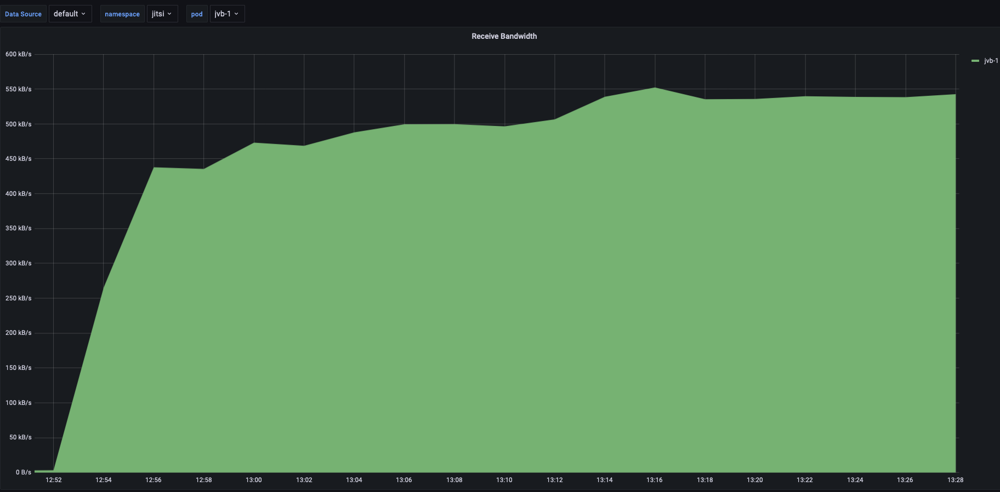 | (Metric fetched from the Kubernetes exporter) |
| Received bandwidth jvb2 | 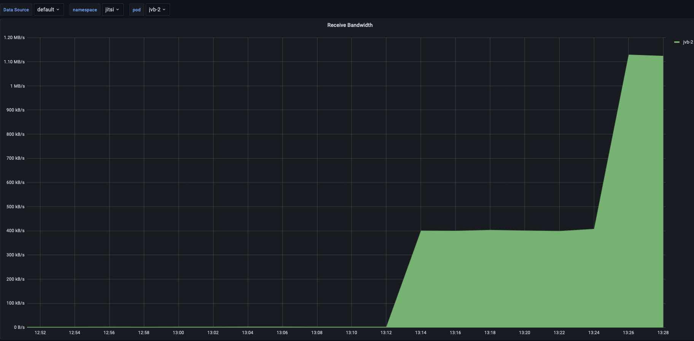 | (Metric fetched from the Kubernetes exporter) |
| Stress level of jvb0        | 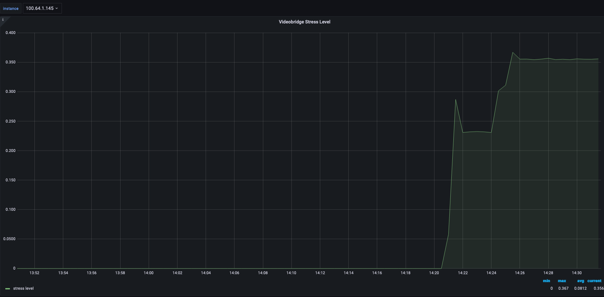               | (Metric fetched from the Jitsi API) Stress level, which is the metric used by Octo to see if JVB is overwhelmed         |
| Stress level of jvb1        | 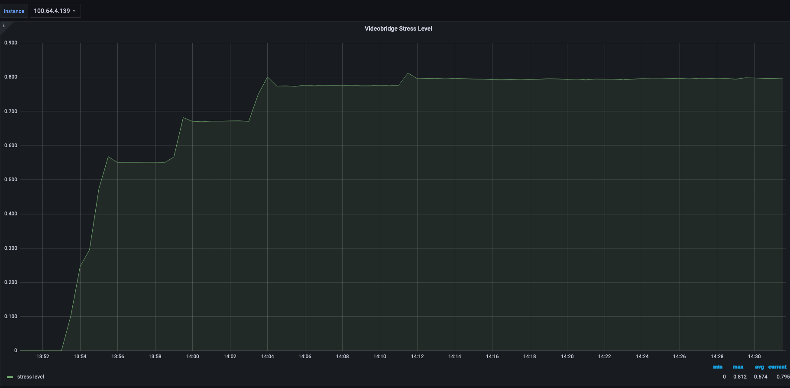               | (Metric fetched from the Jitsi API) Stress level, which is the metric used by Octo to see if JVB is overwhelmed         |
| Stress level of jvb2        | 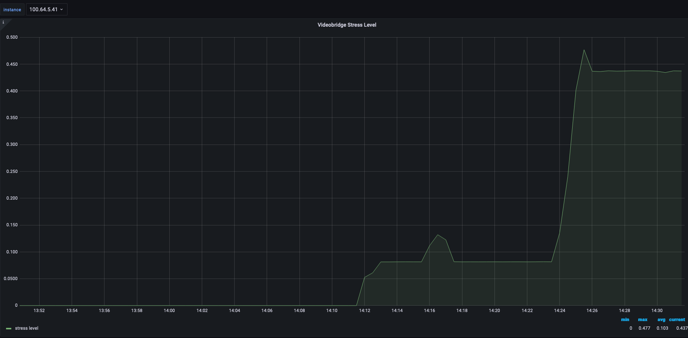               | (Metric fetched from the Jitsi API) Stress level, which is the metric used by Octo to see if JVB is overwhelmed         |

## Interpretation of results

This solution mixes interesting concepts that we saw in SingleBridge and SplitBridge. First, it reduces stress on the network, because it privileges putting people of the same conference on the same JVB. But it does not limit one conference's capacity : when a JVB is overloaded, it chooses another one, so that conference can still go on smoothly.

The notion of "JVB is overloaded" is linked to JVB stress level: with the configuration of [jitsi-k8s](https://github.com/openfun/jitsi-k8s/tree/59bdc9c799db3f0decedbb4b6f870f246091d7c8), the variable BRIDGE_STRESS_THRESHOLD is set at 0,8. So when stress level is over 0,8 when a participant joins a conference, this participant is put on another JVB.

If all JVBs are over the stress threshold, then the participant is put on the least loaded JVB.

The concept of Region is also interesting, if the infrastructure is located at multiple places. However, even with one Region, this strategy is interesting, as it has great mechanisms.

## Conclusion

The RegionBasedStrategy helps reduce stress on the network while not limiting conferences. It is useful, even when one only has one region for its JVBs.
