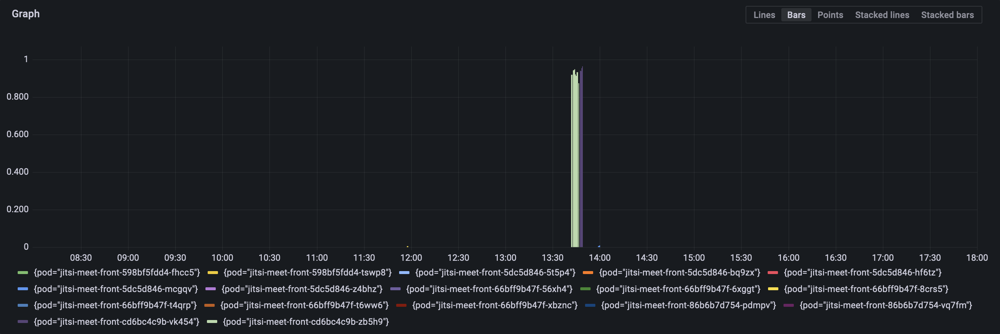
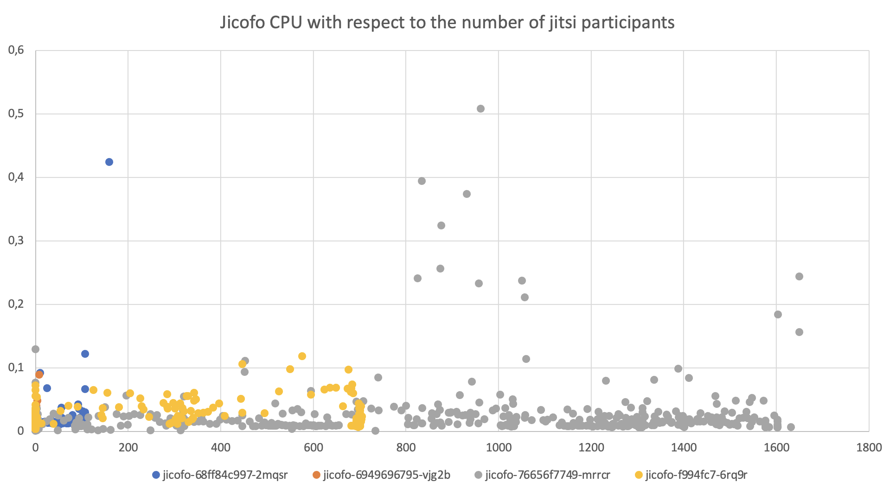
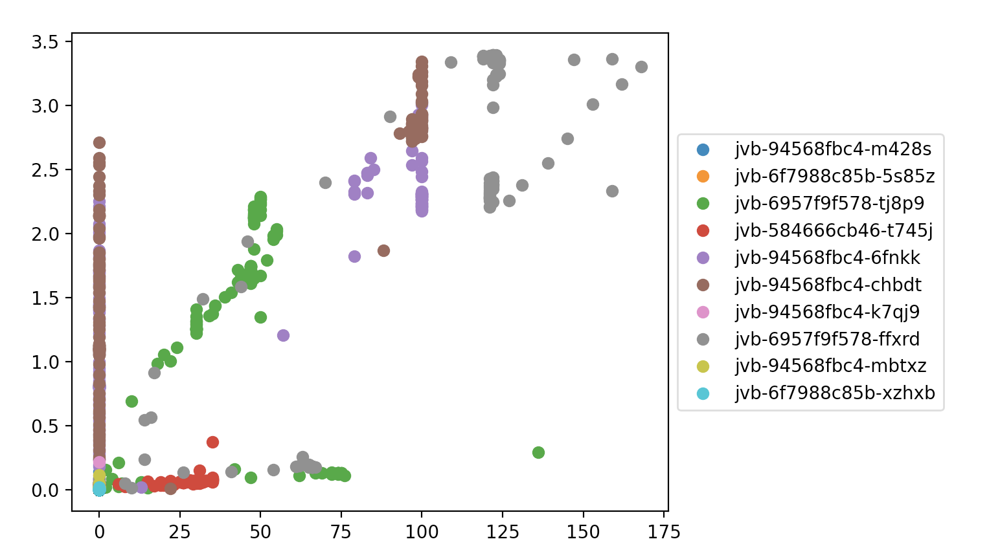

# Load test n°9, 24/02/2022

## Context

We want to test how Jitsi handles a large number of conferences and participants.
We also want to test a newly implemented HPA for jitsi-meet-front.

Thirdly, we want to know if the parameters of the JVB HPA are well chosen or not.

Lastly, a part of this test is reserved to know what is the maximum number of participant in a single conference.

---

## Description of the infrastucture

The Jitsi infrastucture we are working on is deployed on Kubernetes on Scaleway. It is based on the deployment available on the [jitsi-k8s repository of OpenFUN](https://github.com/openfun/jitsi-k8s/commit/b353d5fb3ab8b9ecb2da9a727f8d0aedb7547202). More precisely, here are the specs of the JVB nodepool on our cluster:

- 20 to 90 GP1-XS nodes (4 CPU and 16GB RAM)
- each pod is designed to fill a node
- pod number managed by a HPA

Jicofo and Prosody components were deployed so that each of them filled a GP1-XS node.

Jitsi-meet-front was designed to fill half a GP1-XS node of the default nodepool. The number of jitsi-meet-front pod was managed by a HPA and stayed between 2 and 4.

Jicofo is configured to use `OCTO` with the `RegionBasedBridgeSelectionStrategy`.

Specs of the torture instances:
- 3 CPU
- 4 GB of RAM
- 2 participants per instance

---

## Approach

We deployed Jitsi-Meet-Torture instances in the cloud (on multiple instances on Scaleway) to apply a high load on the infrastructure. We can therefore legitimately assume that we emulate the perfect participants in our conferences that send and receive audio and video without any client-side limit.

We did this test with four computers launching the same number of jitsi-meet-torture instances.

We loaded a big conference of 500 participants and 126 conferences of 30 participants.

---

## Events

At 10:35 we had an issue with the cloud provider what prevented us from creating more instances.

At 11:00 we manually set the desired number of pod in the jvb-hpa to 21 in order to test if the cloud provider issue was a kubernetes issue.

At 12:00, all participants were suddenly disconnected due to an issue on prosody, followed by a second one on the jitsi-meet-front component.

At 14:00 we decided to destroy every jitsi-meet-torture instance to avoid interferences with the metrics.

At 16:30, we decided to restart 355 instances on a single conference. We reached 700 participants at 16:50

---

## Results

All metrics were gathered with Prometheus and visualized with Grafana.

The process was to observe the autoscaling, and how it handles a great number of participants. What component breaks first and why.

We started the test at 10 am and ended at 18 pm.

The number of participants have been tracked down to follow the evolution of metrics in terms of participants:

A number of metrics have been fetched for every component of the Jitsi infrastructure:

| Component        | CPU                                            | RAM (MiB)                                         | Transmit and received rates (MiB/s)                   | Transmit and received packets per seconds            |
| ---------------- | ---------------------------------------------- | ------------------------------------------------- | ----------------------------------------------------- | ---------------------------------------------------- |
| JVB              |          |          |          |          |
| Jitsi-Meet-Front |      |      |      |      |
| Prosody          |  |  |  |  |
| Jicofo           |    |    |    |    |

We observed CPU throttling on two components:

| Component        | Graph of CPU throttling                                 |
| ---------------- | ------------------------------------------------------- |
| JVB              |      |
| Jitsi-Meet-Front |  |

We also measured the Stress Level and the number of pods on each JVB:

Finally, we measured the numbers of replicas that were desired by the HPAs:

### Graphs

We decided to go futher with CPU metrics as it seemed to be the most interesting metric to analyse.

---

Here are the charts of differents functions of the CPU of the Jicofo component with respect to the number of jitsi participants.

| Function                                      | Domain of                  | Graph                                                         |
| --------------------------------------------- | -------------------------- | ------------------------------------------------------------- |
| CPU usage                                     | All metrics                |                        |
| Derivative of the CPU usage (CPU per minute)  | All metrics                |            |
| CPU usage                                     | Metrics from 9:25 to 11:25 |        |
| Derivative of the CPU usage (CPU per minute)  | Metrics from 9:25 to 11:25 |  |

We can see with these metrics that no clear pattern emerges.

---

Here are the charts related to the Jitsi-meet-front component.

| Function  | Time location of metrics   | Graph                                           |
| --------- | -------------------------- | ----------------------------------------------- |
| CPU usage | All metrics                |            |
| CPU usage | Metrics from 9:25 to 11:25 |  |

Be careful when interpreting values of every front pod as we experienced issues with them during the test.

Only the second graph can be used for linear approximation because there was no noticable event from 9:25 to 11:25.

---

Lastly we computed some graphs of the CPU usage with respect to the participants presents in the pod, more charts can be found in the `resources` directory.

|  |  |
| ------------------------------------------------------ | ------------------------------------------------------ |
|  |  |

## Interpretation of results

Video and audio quality were correct whatever the number of participants because Jitsi limits the number of open cameras and its unrealistic to imagine too many people talking at the same time.

We had some problems with OCTO because the BRIDGE_STRESS_THRESHOLD wasn't fit for the test we did. Indeed, some JVB were overloaded before the BRIDGE_STRESS_THRESHOLD reached the value we set up.

We note that at 12:00 the Prosody broke. Checking the logs, we saw that Kubernetes shut it down due the lack of response of the liveness probe. The most probable cause is that he Prosody was to slow to answer.

Looking at other components, the number of nginx worker connections of jitsi-meet-front was too low to handle every client simultaneously. This is due to a misconfiguration of the cluster as jitsi-meet-front was forwarding requests to prosody. This job should be done by an ingress.

### Comparison of Prosody results with previous tests

In order to test our Prosody component, we previously used [the JXS tool](https://github.com/jitsi/jxs), and made available all results on [the OpenFUN jitsi-k8s repository](https://github.com/openfun/jitsi-k8s/blob/main/docs/prosody/TEST.md).

One can observe that the results obtained in this test are slightly differents from the ones on the Jitsi-k8s repository:
- both tests were disturbed by 500 errors from the Jitsi-Meet-Front component, but not at the same amount of participants (which may be explained by the behaviour of JXS that may not be representative of the real functioning of Prosody).
- the slope of the RAM usage per participants is 2.36 times higher than in the tests with JXS.
- the tests with JXS did not highlight the non-linear nature of CPU load and RAM usage at high load.

## Conclusion

According to the tests, we need to resolve the overloading. A solution could be to put an ingress controler to handle the requests instead of the nginx installed in jitsi-meet-front.
The BRIDGE_STRESS_THRESHOLD isn't enough to setup OCTO, we also need to set up a threshold of participant on each JVB.
