# Quick load tests n°2, 16/03/2022

## Context 

The aim of this test is to see if we have a problem with jitsi-meet-torture instances, as they seem to shut off after around 30-40 minutes. 

## Description of the infrastucture

Specs of the JVB nodepool for this test:
- 1 server
- 4 CPU
- 16 GB of RAM
- 1 pod
- no HPA
- no resource limits on the JVB pod

## Approach

We put 12 people in a conference, 10 with cameras, and we leave it be for 30 minutes to see if they disconnect. We look at resource usage on jitsi-meet-torture at the same time to see if the server is overloaded, etc...

## Results on jvb

Jitsi metrics were gathered with Prometheus and visualized with Grafana.

As shown in the following graph, after 30 minutes, we start to lose a few participants. All participants were added at the same time, so this is not due to end of conference (which was set to 6000 seconds)
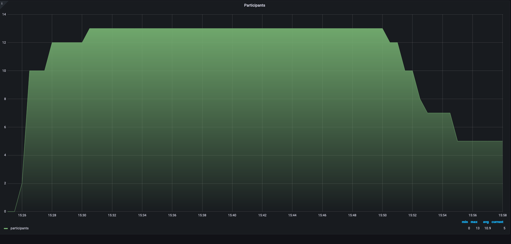

As seen in the following jitsi graphs, all resources were completely constant, there is nothing that could cause a problem after 30 minutes:

| Metric           | Graph                                               | Notes                                                                                         |
| ---------------- | --------------------------------------------------- | --------------------------------------------------------------------------------------------- |
| CPU usage       |              | CPU usage of each JVB                                                |
| RAM usage | 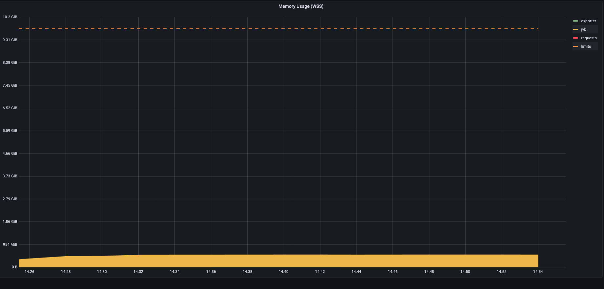 | RAM usage of jvb         |
| Receive bandwidth              | 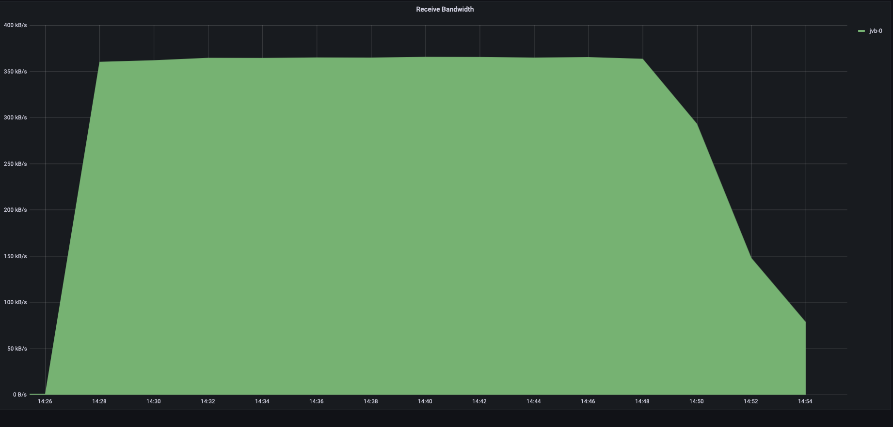                           | Bandwidth in reception of jvb                           |
| Transmit bandwidth | 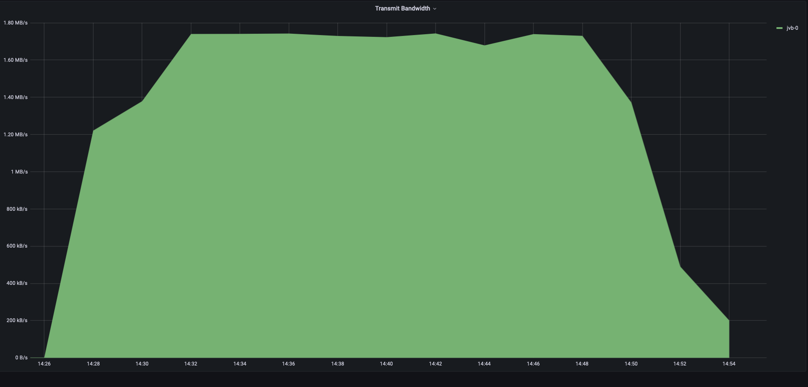 | Bandwidth in transmission of jvb         |
| Websockets | 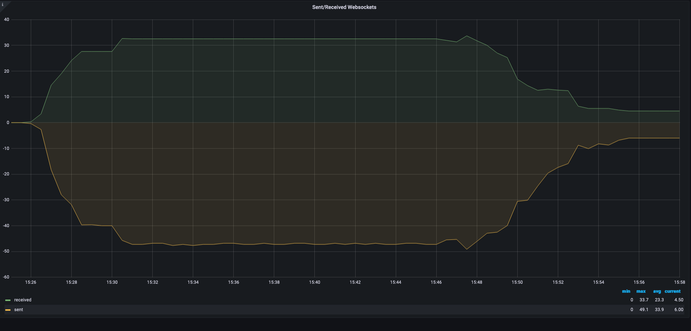 | Number of open websockets       |
| JVB stress level | 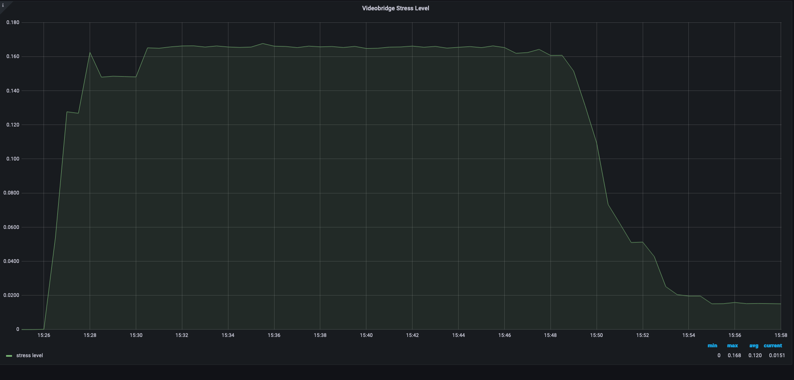 | Stress level of the JVB, defined in the [prometheus exporter](https://github.com/systemli/prometheus-jitsi-meet-exporter)       |
| JVB jitter aggregate |  | (Experimental) [Packet delay variation](https://en.wikipedia.org/wiki/Packet_delay_variation)       |

## Results on torture

Jitsi-meet-torture metrics are gathered with htop and docker stats.

At startup, cpu is quite overloaded, but is still ok:
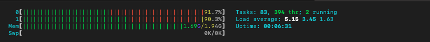

After 15 minutes, things have cooled down and we are far from limit:
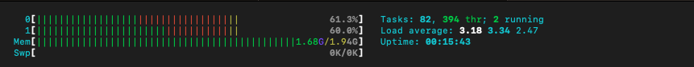
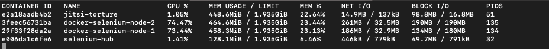

After 30 minutes, on one instance, we lose some stats on docker which indicates a problem:
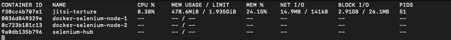

We already have lost multiple participants at this point.

On another instance, things still seem ok:
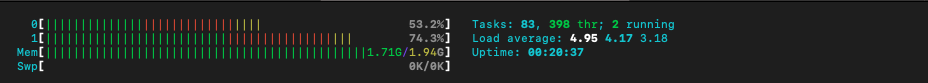

until they do not three minutes later. This instance's cpu becomes overloaded suddenly, as the quality of the camera of some participants becomes very degraded.
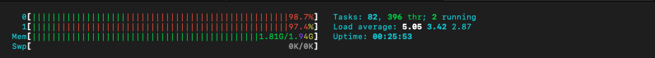

This keeps going going for a few minutes. Then, 38 minutes after the beginning of the conference, one participant gets kicked out and this instance's cpu immediately cools down.
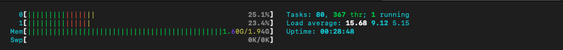.

Only one participant of this instance remained, the other had already been kicked off somewhere in between.

So this shows that what limits the VM is its CPU, but we cannot yet explain why it suddenly becomes overloaded.

## Conclusion

DEV1-S instances are two small for two participants over long conferences with ten cameras. We will use DEV1-M for two participants (or three if tests are conclusive). Previous test results are faulty because of this problem.

Later tests show that 2 participants in DEV1-M can last a long time (over 1 hour) in the same conditions without dropping quality or being kicked out.