# Load test n°7, 24/02/2022

## Context

We want to test the newly implemented HPA in our [jitsi-k8s](https://github.com/openfun/jitsi-k8s) infrastructure.

The goals of this test is multiple:

- Verify that the HPA is working
- See how long will Scaleway take to up a node in case of high load
- Know how jitsi will behave in case of high load

---

## Description of the infrastucture

The Jitsi infrastucture we are working on is deployed on Kubernetes on Scaleway. It is based on the deployment available on the [jitsi-k8s repository of OpenFUN](https://github.com/openfun/jitsi-k8s/tree/85a5610ddd55280954233b6d55c1ff636c1a5fe6). More precisely, here are the specs of the JVB nodepool on our cluster:

- 1 to 5 server
- 4 CPU
- 16 GB of RAM
- pod number managed by a HPA

Every JVB pod is composed of 3 containers, the jvb container resources limits are defined below.

```yaml
resources:
  limits:
    cpu: 3200m
    memory: 13500Mi
  requests:
    cpu: 3200m
    memory: 13500Mi
```

Here are the resources definition for the two other containers.

```yaml
resources:
  limits:
    cpu: 500m
    memory: 500Mi
  requests:
    cpu: 150m
    memory: 500Mi
```

Jicofo is configured to use `OCTO` with the `RegionBasedBridgeSelectionStrategy`.

---

## Approach

We deployed Jitsi-Meet-Torture instances in the cloud (on multiple instances on Scaleway) to apply a high load on the infrastructure. We can therefore legitimately assume that we emulate the perfect participants in our conferences that send and receive audio and video without any client-side limit.

We chose to apply a stress of 200 participant distributed in 4 rooms, plus a human participant.
The test was designed to be launched at 15:30 CET, and every participant was configured to stay 15 minutes inside the room.

Please note that at 15:37, the human participant joined the first room.

---

## Results

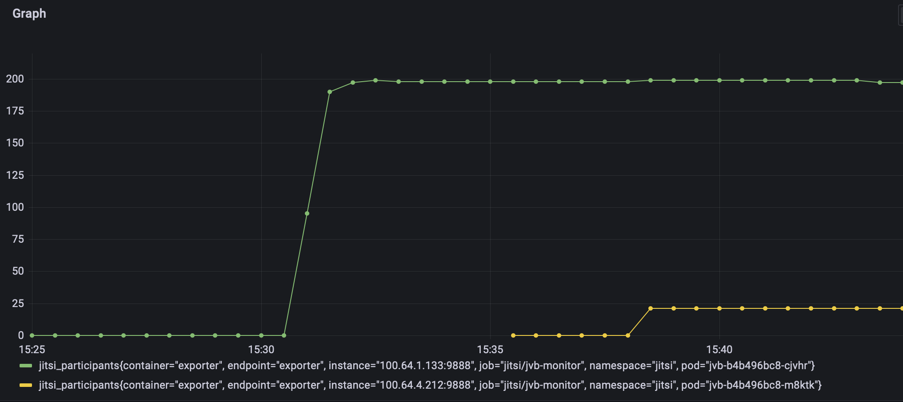

- at t = 0s, a new pod appeared in Pending state
- at t + 2'15, a new node appeared in Not Ready state
- at t + 2'45, the new node appeared in Ready state
- at t + 3', the new pod appeared in Creating state
- at t + 4', the new pod appeared in Ready state

To sum up, it took ~4' after the HPA updated the number of desired JVB pods to have a second working JVB pod.

### JVB metrics

| METRIC                | FIRST JVB                                                   | SECOND JVB
| --------------------- | ----------------------------------------------------------- | --------------------------
| Received bandwidth    | 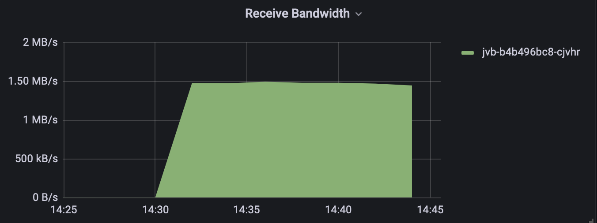  | 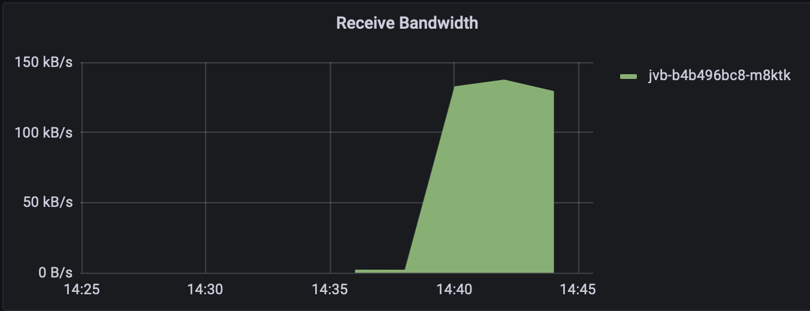
| Transmitted bandwidth | 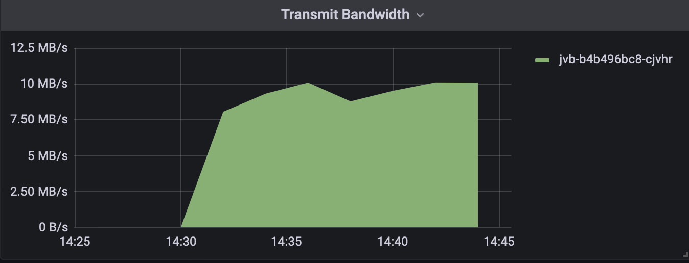     | 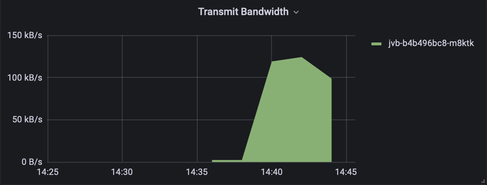
| Received packets      | 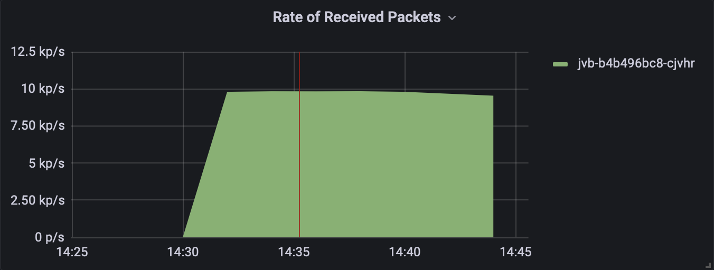      | 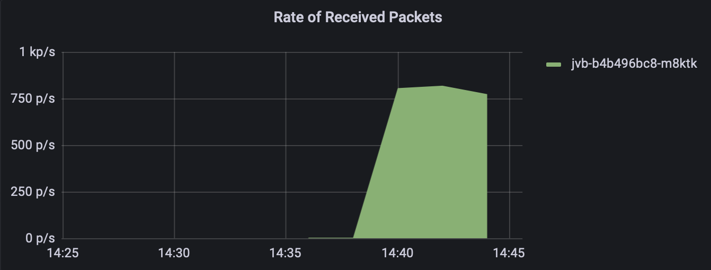
| Transmitted packets   | 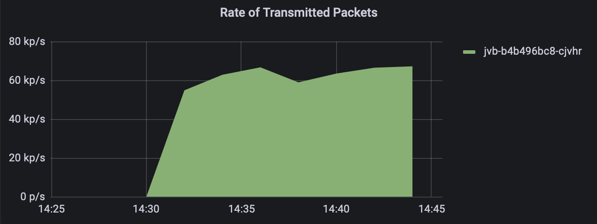         | 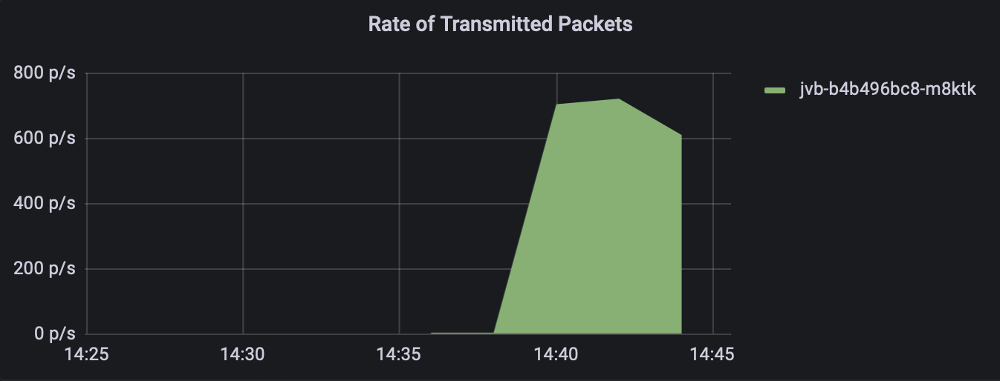
| CPU usage             | 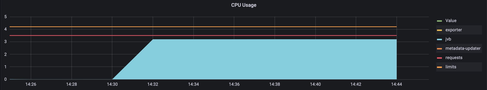           | 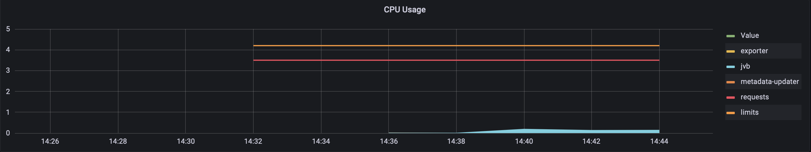
| CPU throttling        | 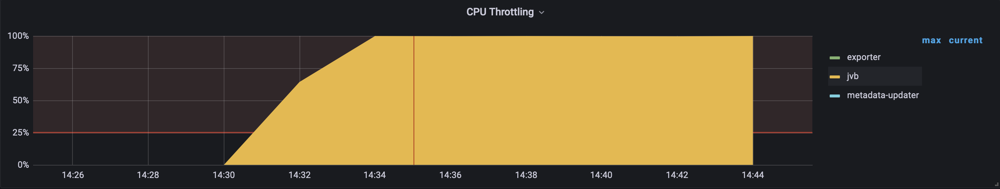 | 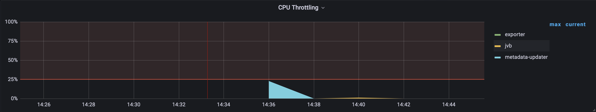
| Memory usage          | 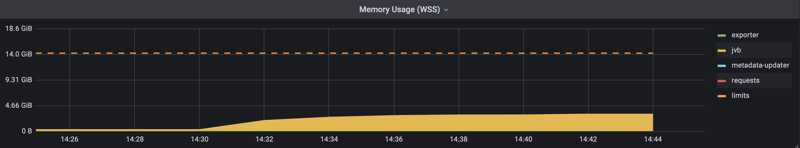     | 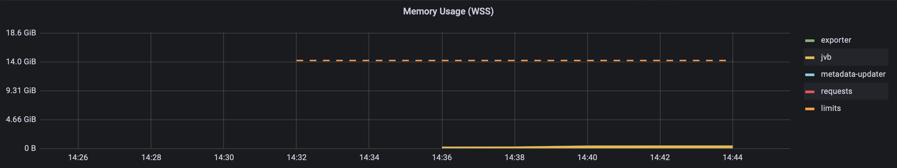

### Metrics of other components

| METRIC                   | CHART
| ------------------------ | -------------------------------------------------------------------
| Jicofo CPU usage         | 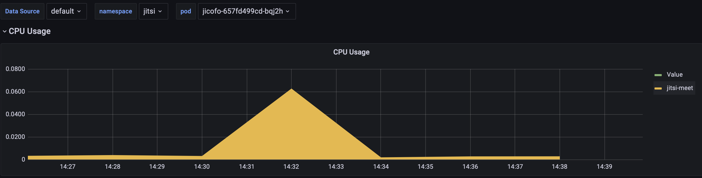
| Prosody CPU usage        | 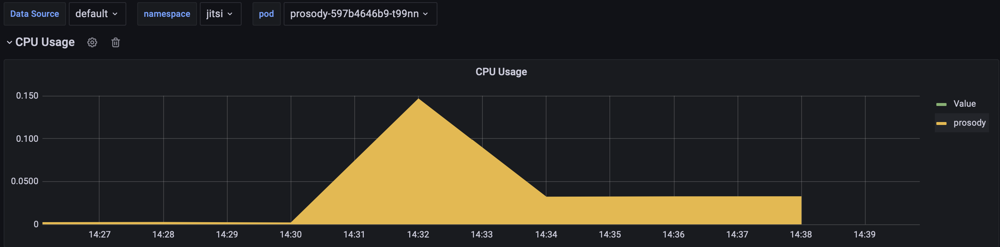
| Prosody memory usage     | 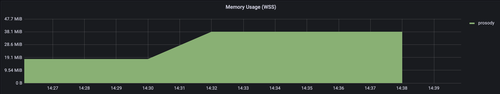
| Jitsi-front CPU usage    | 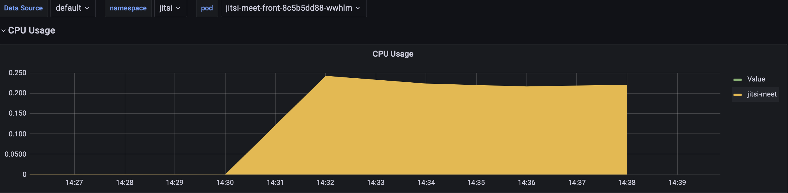
| Jitsi-front memory usage | 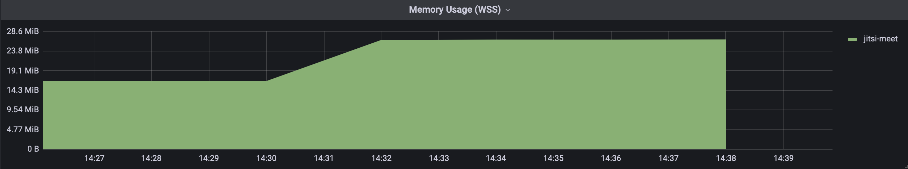

---

## Interpretation of results

At 15:35:30, the second JVB pod is ready, but there is no load balancing when the JVB is ready.
This is explained by the fact that participants have already joined their conferences, and were assigned to the first JVB.
The human participant was assigned to the second JVB because he joined his meeting when the second JVB was ready.

---

## Conclusion

The HPA is working and we need approximatively 5 minutes to have a second JVB, further investigations will be needed to optimize the scaling of JVB pods.

Once a participant is connected to a conference and assigned to a JVB, he will not be moved to another one unless he disconnects and connects again.
Having this behaviour, if a JVB is overloaded, creating other JVB will not balance the load on all instances.
Newly created JVB will only prevent new participant to be assigned to an overloaded JVB.
Thus we can not reduce the load on a JVB unless some participants who are assigned to it leave their meetings.
This is why it is very important to keep a low load on each JVB pod, and also to keep JVB pods in advance.
